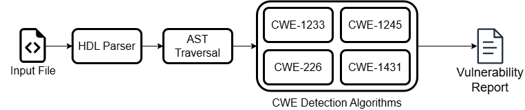
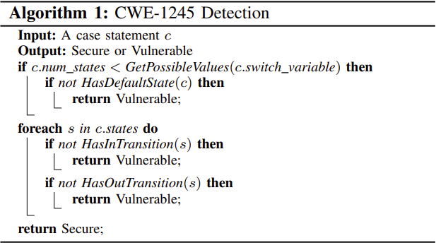
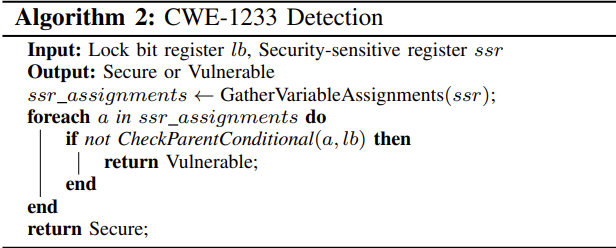
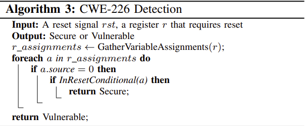
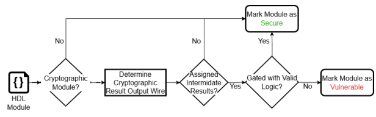

# **PickyRTL - Detection**

## **Overview**

The document is organized into the following sections:
- [Detection Workflow](#detection-workflow)
- [Detection Algorithms](#detection-algorithms)
    - [CWE-1245](#cwe-1245)
    - [CWE-1233](#cwe-1233)
    - [CWE-226](#cwe-226)
    - [CWE-1431](#cwe-1431)

## **Detection Workflow**

The detection workflow begins by parsing an HDL input file. The parsed HDL is converted into a JSON-based Abstract Syntax Tree (AST) and stored in the Parsed_Files directory. When a file is selected for analysis, the JSON AST is processed by the AST traverser, which extracts the relevant structural and semantic information required by the CWE detection algorithms and stores it in a Python object. This object is then passed to the CWE detection algorithms for analysis. After the analysis is complete, a vulnerability report is generated and saved in the Results directory.

## **Detection Algorithms**

This section will go into further depth on how each CWE detection algorithm works, its limitations, and possible improvements to make in the future.

## CWE-1245

CWE-1245 refers to improper finite state machines (FSMs) in hardware logic. The three main patterns associated with this weakness are incomplete state coverage, unreachable states, and deadlock states.

### Current Algorithm

During AST traversal, case statements are converted into case statement node objects that associate assignments to the state variable with the states defined within the case statement. Each detected case statement is then passed to the CWE-1245 detection algorithm for analysis.

First, the algorithm checks the case statement for incomplete state coverage. This is done by calculating the number of possible values of the state variable based on its bit width. For example, a 2-bit register has four possible values, while a 3-bit register has eight possible values. If the number of defined states matches the number of possible values, the case statement is marked as `Secure` for state coverage. Otherwise, the algorithm checks whether a default case is present. If no default case is defined, the case statement is marked as `Vulnerable`. If a default case exists, the algorithm analyzes it to determine whether any conditional logic restricts coverage of possible state values. If such a restriction exists, the case statement is marked as `Vulnerable`; otherwise, it is marked as `Secure`.

Second, the algorithm checks for unreachable states. If the state variable used in the case statement is a module input, the result is marked as `Inconclusive`, since transitions may be externally controlled and therefore not visible within the module. Otherwise, all direct and indirect assignments to the state variable are collected. Each assignment is verified to ensure it is reachable and not blocked by unsatisfiable conditional logic. The algorithm then compares each state defined in the case statement against the collected assignments. If a state value is never assigned to the state variable, it is added to a list of unreachable states. If no unreachable states are found, the case statement is marked as `Secure`. If unreachable states exist, the algorithm checks whether the state variable is mapped to another module. If it is, the result is marked as `Inconclusive` because transitions may occur outside the analysis scope. If the state variable is not externally mapped and unreachable states remain, the case statement is marked as `Vulnerable`.

Finally, the algorithm checks for deadlock states. Similar to the unreachable state analysis, the result is immediately marked as `Inconclusive` if the state variable is a module input. The algorithm then gathers all direct and indirect assignments to the state variable and converts them into transitions between states (from start state to end state). A list of states is created, and states are removed from this list whenever an outgoing transition is detected while iterating through the transitions. If no states remain after this process, the case statement contains no deadlock states and is marked as `Secure`. If states remain, potential deadlock states exist. If the state variable is mapped to another module, the result is marked as `Inconclusive` because transitions may be externally controlled. Otherwise, if at least one deadlock state remains, the case statement is marked as `Vulnerable`.

### Limitations

- Case statements in which the state variable is derived from parameters or concatenations are currently skipped. Only case statements using a single state variable are supported.

- The detection algorithm performs poorly when next-state logic is distributed across multiple case statements that reference the same state variable.
    - A fix for this limitation is currently being developed in the version-2 branch.

## CWE-1233

CWE-1233 refers to security-sensitive hardware controls with missing lock bit protection. Lock bits are mechanisms used to prevent unauthorized modification of protected registers. A vulnerability can occur when lock bit protection is incorrectly implemented or not implemented at all.

### Current Algorithm
During AST traversal, lock bits and security-sensitive registers must first be identified. To detect potential lock bits, module input names are checked against the following regex pattern:

`(?<!b)lock, lck, (?<!c)lk(?!c)`

If a module input matches this pattern, it is marked as a possible lock bit. Identified lock bits are then used to discover security-sensitive registers. When an assignment node is created during traversal, the traverser checks whether the assignment occurs within a conditional that references a lock bit. If so, the destination register of that assignment is marked as a security-sensitive register. These registers are added to a global list that is used after all files have been traversed.

When detection is run on a folder, additional security-sensitive registers are identified using fuzzy name matching. The names of previously identified security-sensitive registers are compared against other register names to identify closely matching names. This step is intended to capture registers that are similarly named and therefore may require similar lock bit protection.

After identifying security-sensitive registers, the algorithm searches for two CWE-1233 weakness patterns.

First, the algorithm verifies lock enforcement. This check ensures that assignments protected by lock bits correctly reject unauthorized writes when the lock bit is asserted. All assignments to the security-sensitive register that appear under lock-bit protection are collected. If an assignment allows writes only when the lock bit is 0, it is considered incorrectly enforced and added to a list of improperly protected assignments. If no incorrectly enforced assignments are found, the register is marked as `Secure` for lock enforcement. Otherwise, if one or more incorrectly enforced assignments are detected, the register is marked as `Vulnerable`.

Second, the algorithm checks protection coverage for each security-sensitive register. All assignments to the register are collected into a list. Reset assignments and assignments that simply reassign the register to itself are removed from this list. The remaining assignments are then checked for lock bit protection. If an assignment is protected by a lock bit, it is removed from the list. If no unprotected assignments remain, the register is marked as `Secure` for security-sensitive register coverage. If one or more unprotected assignments remain, the register is marked as `Vulnerable` for security-sensitive register coverage.

### Limitations

- Lock bit identification relies on register names matching the defined regex patterns. If a lock bit does not match these patterns, it will not be detected, potentially resulting in false negatives.

- The identification of security-sensitive registers depends on both lock bit detection and the presence of assignments already protected by lock bits. If a register does not have any assignments protected by a lock bit, it may not be identified as security-sensitive, which can also lead to false negatives.
    - Improving the identification of security-sensitive registers would significantly improve the effectiveness of the CWE-1233 detection algorithm.

## CWE-226

CWE-226 refers to sensitive information remaining in a resource after it is reused. In hardware designs, this weakness can occur when a register containing sensitive information (e.g., a plaintext message) is not cleared before a critical state transition, such as a module reset.

### Current Algorithm

During AST traversal, reset signals must first be identified. To detect these signals, module input names are checked for the presence of the keywords `reset` or `rst`. If a module input contains one of these keywords, it is marked as a reset signal.

To determine which registers should be cleared during reset, the algorithm reuses the list of security-sensitive registers identified during CWE-1233 detection.

To detect CWE-226 weaknesses, the algorithm analyzes each procedural block defined within the module. If a security-sensitive register is assigned a value within a procedural block, the register must also be reset within that same block using reset logic.

For each procedural block, the algorithm identifies registers that require reset behavior and gathers assignments that zeroize the contents of those registers. If one of these assignments occurs within a conditional that depends only on reset signals, the register is marked as `Secure` for reset coverage. If none of the assignments that clear the register occur under a conditional containing the reset signals, the register is marked as `Vulnerable` for reset coverage.

### Limitations

- The current algorithm checks reset coverage only for the security-sensitive registers identified by the CWE-1233 detection algorithm. This creates a tight coupling between the two detection methods and may cause some registers that require reset behavior to be missed.
    - A potential improvement would be to identify registers that are reset within the module and use name similarity or structural analysis to infer additional registers that should also be reset.

## CWE-1431

CWE-1431 refers to driving intermediate cryptographic states or results to hardware module outputs. This weakness occurs when the output of a cryptographic algorithm is assigned to a module output before the result has been confirmed to be valid.

### Current Algorithm

Since this weakness applies specifically to cryptographic modules, these modules must first be identified. During AST traversal, a module is marked as a cryptographic module if its name matches the following regex pattern:

`(?i)(?<![A-Za-z0-9])(?:aes\d*|sha\d*|crypto|hmac|md5|otp(?:_ctrl|_scrmbl)?|chacha|scrambl|cipher|hash|mac|keccak)(?![A-Za-z0-9])`

After traversal is complete, any identified cryptographic modules are analyzed for CWE-1431 weaknesses. First, the module output that contains the result of the cryptographic operation is identified using a keyword scoring system. Keywords commonly associated with result outputs are assigned scores, and each module output is evaluated based on the presence of these keywords in its name. The output with the highest score is marked as the result output.

A similar keyword scoring process is then used to identify the output signal that indicates when the result is valid. Once the result output and valid signal have been identified, all assignments to the result output are collected.

Each assignment is then analyzed to determine whether it is gated by a conditional that references the valid signal. If an assignment to the result output occurs without checking the valid signal, the module is marked as `Vulnerable` to leaking intermediate states or results. If all assignments to the result output are properly gated by a valid check, the module is marked as `Secure`.

### Limitations

- Currently, only the result output is checked for CWE-1431 vulnerabilities and disregards other outputs from leaking intermediate signals. This design decision was made due to patterns from RTL designs gathered from open-source repositories. 
    - The detection logic could be improved by checking all outputs for leakage.
- If a cryptographic module is named somethign where it does not match the regex pattern, it will not be checked for CWE-1431 vulnerabiltiies
    - A more general way to identify cryptographic modules would improve the detection
