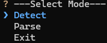
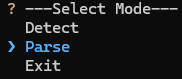
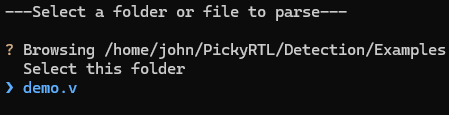
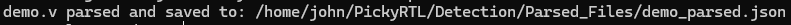
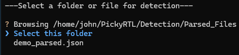
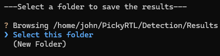
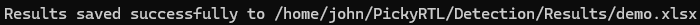

# **PickyRTL - Using the Tool**

## **Overview**

This document explains how to use the PickyRTL detection tool to analyze Verilog and SystemVerilog RTL files for potential hardware security vulnerabilities. It provides instructions for adding HDL files, running the program, parsing files, running vulnerability detection, and interpreting the results.

The document is organized into the following sections:
- [Add and HDL File](#add-an-hdl-file)
- [Running the Program](#running-the-program)
- [Parsing](#parsing)
- [Detection](#detection)
- [Understanding the Results](#understainding-the-results)

## **Add an HDL File**

If you want to add an HDL file for detection, you must add it to the `/Examples` folder.

Supported file types:
- `.v` - Verilog
- `.sv` - SystemVerilog

Once a file has been added to the `/Examples` folder, it will be availabel to parse and then run detection on.

## **Running the program**

To set up dependencies and run PickyRTL, execute the `run_program.sh` bash script from the `/Detection` folder.

```bash
./run_program.sh
```

If you have all the dependencies installed already, you can run PickyRTL with `main.py` from the `/Detection` folder.

```bash
python3 main.py
```

When it starts, you should see three options.



## **Parsing**

To parse a file select 'Parse'.



Navigate to the file you want to parse and then press 'Enter'. You can also parse multiple files at once by selecting 'Select this folder' when a folder contains only Verilog or SystemVerilog files. 



You should see the parsed file location.



**A file must be parsed before you can run detection on that file**

## **Detection**

To run detection, select 'Detect'.


Navigate to the file you want to run detection on and then press 'Enter'. You can also run detection on multiple files at once by selecting 'Select this folder' when a folder contains only parsed Verilog and SystemVerilog files.



You will then select where you want to save the results. You can naviate to your desired folder, create a new folder, or select the current folder. 



Once you have selected the folder for the results, enter the name for the file.


You will then see the path of the saved results. Results are stored in `.xlsx` file



## **Understainding the Results**

Within the results file there are five sheets.

CWE-1245 Results
-
Contains the following columns:
- File Name
    - Name of the file
- Module Name
    - Name of the module
- Case Number
    - The number of the case statement in the module
- State Coverage
    - States whether the case statement is 'Secure', 'Vulnerable', or 'Inconclusive' with respect to incomplete state coverage
- Unreachable States
    - States whether the case statement is 'Secure', 'Vulnerable', or 'Inconclusive' with respect to unreachable states
- Deadlocks
    - States whether the case statement is 'Secure', 'Vulnerable', or 'Inconclusive' with respect to deadlocks

The last row is the total row that shows the total number of case statements, number of secure case statements, number of vulnerable case statements, and number of inconclusive case statements.

CWE-1233 Results
-
Contains the following columns:
- File Name
- Module Name
- Security Sensitive Register
    - Name of the security sensitive register that needs lock bit protection
- Assignment Line Numbers
    - Line numbers of assignemnts to the security sensitive register
- Lock Enforcement
    - States whether the register is 'Secure', 'Vulnerable' with respect to all locked assignments being properly enforced
- Security Sensitive Register Coverage
    - States whether the register is 'Secure' or 'Vulnerable' with respect to all assignments to the register being protected with a lock bit

The last row is the total row that shows the total number of security sensitive registers, number of secure registers, and number of vulnerable registers.

CWE-226 Results
-
Contains the following columns:
- File Name
- Module Name
- Register
    - Register that needs to be reset
- Reset Coverage
    - States whether the register is 'Secure', 'Vulnerable' with respect to being reset properly

The last row is the total row that shows the total number of registers needing reset, number of secure registers, and number of vulnerable registers.

CWE-1431 Results
-
Contains the following columns:
- File Name
- Module Name
- Result Output
    - Output wire containing the result of the cryptographic algorithm
- Intermediate State/Results Leakage
    - States whether the module is 'Secure', 'Vulnerable' with respect to intermediate state/results leakage

The last row is the total row that shows the total number ofcryptographic modules, number of secure modules, and number of vulnerable modules.

Detection Statistics
-
Contains the following columns:
- File Name
- Module Name
- LoC
    - Total lines of code within the file
- Detection Time
    - Total detection time spent on the file

The last row is the total row that shows the total number of modules, total lines of code, and total detection time.
